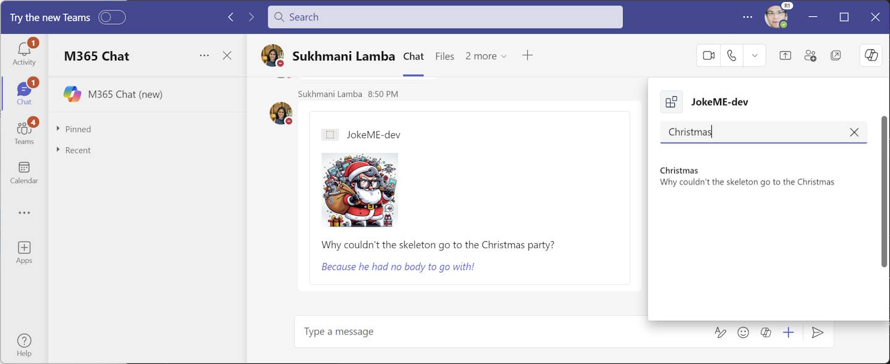

# Overview of Joke API Message Extension

## Build API Plugin from OpenAPI Spec

The plugin allows Teams to interact directly with third-party data, apps, and services, enhancing its capabilities and broadening its range of capabilities. Plugins allow Teams to:

- Retrieve real-time information, for example, latest news coverage on a product launch.
- Retrieve knowledge-based information, for example, my team’s design files in Figma.

## Get started with this sample

> **Prerequisites**
>
> To run the Joke API Message Extension on your local dev machine, you will need:
>
> - [Node.js](https://nodejs.org/), supported versions: 16, 18
> - A [Microsoft 365 account for development](https://docs.microsoft.com/microsoftteams/platform/toolkit/accounts).
> - [Teams Toolkit Visual Studio Code Extension](https://aka.ms/teams-toolkit) version 5.0.0 and higher or [Teams Toolkit CLI](https://aka.ms/teamsfx-cli)

1. First, select the Teams Toolkit icon on the left in the VS Code toolbar.
2. In the Account section, sign in with your [Microsoft 365 account](https://docs.microsoft.com/microsoftteams/platform/toolkit/accounts) if you haven't already.
3. Create Teams app by clicking `Provision` in "Lifecycle" section.
4. Select `Preview in Teams (Edge)` or `Preview in Teams (Chrome)` from the launch configuration dropdown.
5. When Teams launches in the browser, you can navigate to a chat message and [trigger your search commands from compose message area](https://learn.microsoft.com/microsoftteams/platform/messaging-extensions/what-are-messaging-extensions?tabs=dotnet#search-commands).
6. Search for a joke via a specific keyword and insert the Adaptive Card in the chat 

## What's included in the template

| Folder       | Contents                                     |
| ------------ | -------------------------------------------- |
| `.vscode`    | VSCode files for debugging                   |
| `appPackage` | Templates for the Teams application manifest, the API specification and response templates for API responses |
| `env`        | Environment files                            |

The following are Teams Toolkit specific project files. You can [visit a complete guide on Github](https://github.com/OfficeDev/TeamsFx/wiki/Teams-Toolkit-Visual-Studio-Code-v5-Guide#overview) to understand how Teams Toolkit works.

| File                 | Contents                                                                                                                                  |
| -------------------- | ----------------------------------------------------------------------------------------------------------------------------------------- |
| `teamsapp.yml`       | This is the main Teams Toolkit project file. The project file defines two primary things: Properties and configuration Stage definitions. |
| `jokeapi.yaml`       | An OpenAPI wrapping around https://jokeapi.dev/. |
| `appPackage/responseTemplates/getAnyJoke.json`       | A slightly designed Adaptive Card schema to match the JSON output of the Joke API |
| `appPackage/responseTemplates/getAnyJoke.data.json`       | Mocking data of the Joke API to let you preview the adaptive card using the Adaptive Card Previewer extension |

## Addition information and references

- [Extend Teams platform with APIs](https://aka.ms/teamsfx-api-plugin)
